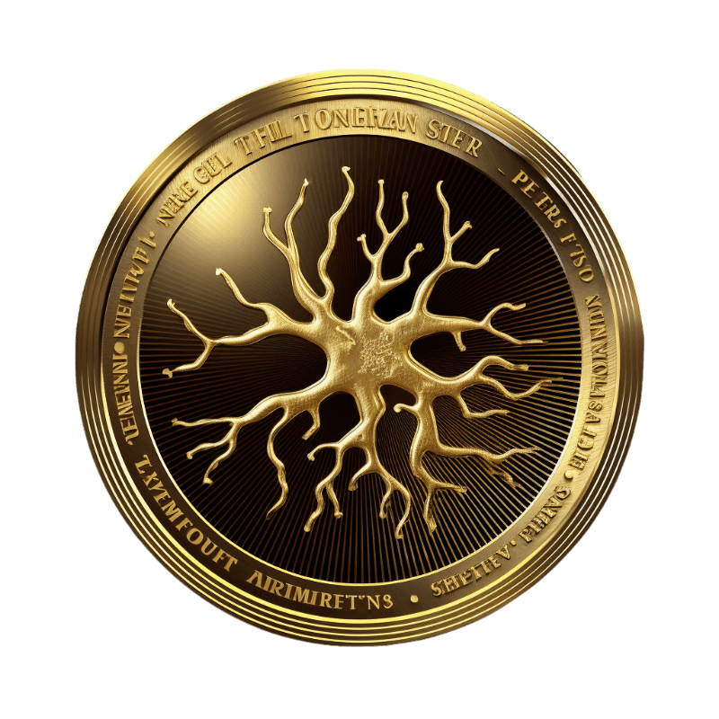

# Getting Started

Think in Coin is a project that aims to bridge the gap, between Web2 and the exciting Web3 by using a language that everyone can understand. Our main focus is on providing in depth content about the market. We offer courses through the Think in Coin Academy, where you can learn everything about cryptocurrencies, blockchain technology, DeFi, tokenomics and more.

Our educational platform provides a learning experience with lessons progress tracking and certifications to help you enhance your knowledge and skills.

In addition to education we also offer a service that allows individuals and communities to create customized meme tokens. This service encourages engagement and creativity within the space. We prioritize community involvement, potential for monetization and expert guidance throughout the meme token creation process.

Furthermore we are developing a platform that will provide insights into cryptocurrency projects. This platform will empower you to make investment decisions by offering project profiles market analysis reports, tokenomics information, community engagement metrics and more.

To ensure governance within our project and community we have integrated Aragon—an autonomous organization (DAO) platform. This integration facilitates decision making processes with transparency at its core.

At Think in Coin we are dedicated to bridging knowledge and innovation in the world while fostering an environment, for learners of all backgrounds.

## **The Dream?**

FREEDOM!

The release of the bonds of an oppressive and corrupt financial system that has the indecency to dictate the rules of how and how much you can profit from your investments.

THIS TIME IS OVER.

Now you must be your own bank. Enjoy it.

