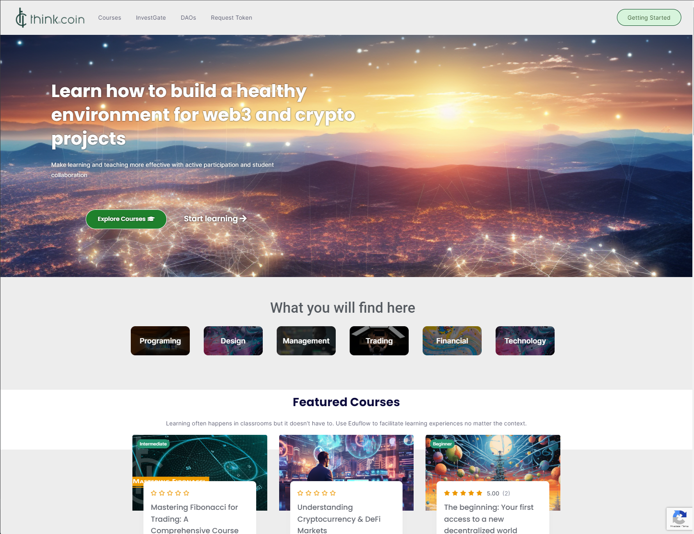

# Design and User Interface

Overall Design Concept

The design concept is centered around creating a user-friendly, accessible, and engaging platform for cryptocurrency education and community interaction. It focuses on a clean, modern, and intuitive interface that caters to users with varying levels of expertise in blockchain and cryptocurrency.

**Key Design Principles**

**User-Centric**: The design prioritizes the user's experience, making it easy for users to navigate, access content, and engage with the community.

**Clarity and Simplicity**: Information is presented clearly and concisely. Complex concepts are broken down into digestible modules.

**Engagement**: The design encourages user engagement through interactive features like forums, chat, and user-generated content.

**Consistency**: A consistent design language is maintained throughout the platform, ensuring a unified user experience.

**Accessibility**: The design adheres to accessibility standards, making the platform usable for all, including those with disabilities.

#### Mock-ups of User Interface:

Here are some mock-ups and wireframes illustrating the user interface for "Think in Coin." Please note that these are conceptual representations, and the actual design may vary based on development decisions and user feedback.

**Homepage:**

<figure><figcaption></figcaption></figure>

**Course Listing:**

<figure><figcaption></figcaption></figure>

**Course Content Page:**

<figure><figcaption></figcaption></figure>

**Blockchain Information:**

<figure><figcaption>
explorer.harmony.one
</figcaption></figure>

**Community Forum:**

<figure><figcaption>
t.me/thinkincoin
</figcaption></figure>

**Meme Token Creation Interface:**

soon...

These mock-ups provide a visual representation of the design concept, including the homepage, course pages, blockchain information section, community forum, and the meme token creation interface. The final design will incorporate user feedback, responsive design for various devices, and accessibility features to ensure a seamless and inclusive user experience.

\
