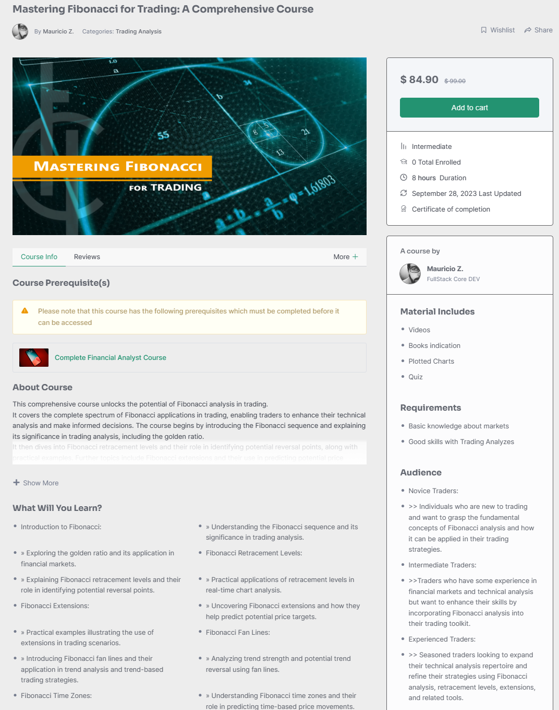

# Roadmap

Ok so it's not actually a roadmap: it's a to-do list, in no particular order, with no particular timeline. This is how we work: as fast as we can, on the things we can. Pivoting is a way of life.

#### **Full Site Rework**

* [ ] New homepage
* [ ] Harvest all & stake all
* [ ] Personal dashboard
* [ ] Improved UX
* [ ] Faster site
* [ ] Mobile friendly
* [ ] New navigation system

#### **SYRUP**

* [x] **SYRUP Staking**
* [x] **Core SYRUP Pools**
* [x] **Community SYRUP Pools:** Host BSC community project SYRUP Pools and support with 0.1-0.2x CAKE farms

#### Other products

* [x] **Lottery \(core feature\)**
* [x] **Analytics \(core feature\)**
* [x] **Voting \(core feature\)**
* [ ] **IFO \(Initial Farm Offering\):** Raise funds for your project in CAKE-BNB LP tokens. After redeeming the LP tokens, the BNB is distributed to the project and the CAKE is burned.
* [ ] **Lending & Borrowing:** Lend and borrow BSC and LP tokens - CAKE provides rate discount
* [ ] **Margin Trading:** Trade BSC tokens with leverage on-chain — periodic CAKE buyback and burn
* [ ] **NFT Ecosystem:** Mint, trade, breed, and more — all paid in CAKE
* [ ] **NFT-based Gamification:** Complete tasks, level up etc. to earn NFTs — use CAKE to mint

