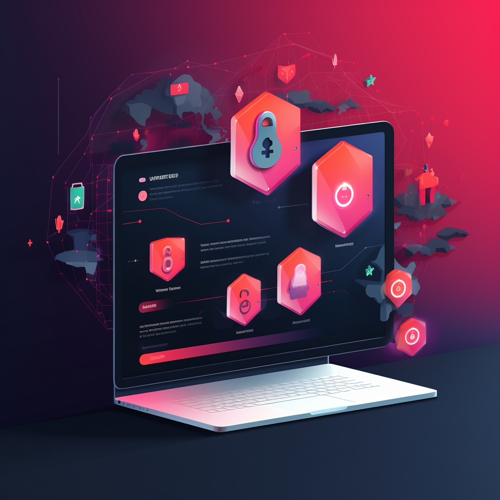

# Security

<figure><figcaption></figcaption></figure>

#### Security Measures for User Data and Transactions:

Ensuring the security of user data and transactions is paramount for us. Here are key security measures in place to protect user information and financial transactions:

Data Encryption: All data transmission between users and the platform is encrypted using HTTPS (SSL/TLS) to protect against eavesdropping and data interception.

User Authentication: Strong user authentication methods are implemented, including multi-factor authentication (MFA) to verify user identities and protect against unauthorized access.

Authorization: Role-based access control (RBAC) restricts access to sensitive areas of the platform. Users are only granted permissions necessary for their roles.

Secure Storage: User data, including passwords and personal information, is securely hashed and stored in databases. Sensitive data is never stored in plain text.

Regular Security Audits: The platform undergoes regular security audits and vulnerability assessments to identify and address potential security weaknesses.

Firewalls and Intrusion Detection: Firewalls and intrusion detection systems (IDS) are in place to monitor network traffic and detect and prevent unauthorized access or attacks.

Security Patch Management: Prompt installation of security patches and updates for all software components to address known vulnerabilities.

Secure Development Practices: Developers follow secure coding practices to prevent common vulnerabilities like SQL injection, cross-site scripting (XSS), and cross-site request forgery (CSRF).

Secure APIs: All APIs are secured with proper authentication and authorization mechanisms to prevent unauthorized access to data.

Payment Security: If processing payments, Payment Card Industry Data Security Standard (PCI DSS) compliance is maintained to safeguard credit card information.

Security Incident Response Plan: A documented incident response plan is in place to handle security breaches promptly and effectively, including communication with affected users.

User Education: Users are educated about security best practices, including password hygiene, recognizing phishing attempts, and safeguarding personal information.

#### Compliance Requirements

Depending on the location and nature of operations, Think in Coin may be subject to various compliance requirements. Here are some key compliance considerations:

General Data Protection Regulation (GDPR): If serving users in the European Union, compliance with GDPR is crucial. This includes user consent for data processing, the right to be forgotten, and data protection impact assessments.

Payment Card Industry Data Security Standard (PCI DSS): If handling credit card transactions, PCI DSS compliance is necessary to protect cardholder data.

Anti-Money Laundering (AML) and Know Your Customer (KYC) Regulations: Depending on the platform's services, AML and KYC compliance may be required to prevent money laundering and verify user identities.

Securities Regulations: If offering investment-related services or token offerings, compliance with securities regulations is necessary to ensure legal operations.

Blockchain and Cryptocurrency Regulations: Our focus is 100% Defi. Regulations are responsible for each user by default country laws.

Accessibility Standards: Compliance with web accessibility standards, such as the Web Content Accessibility Guidelines (WCAG), may be required to make the platform accessible to individuals with disabilities.

Compliance with these regulations and standards not only ensures legal operations but also enhances trust and security for users. We should continuously monitor and adapt its compliance efforts to evolving legal and regulatory landscapes.
